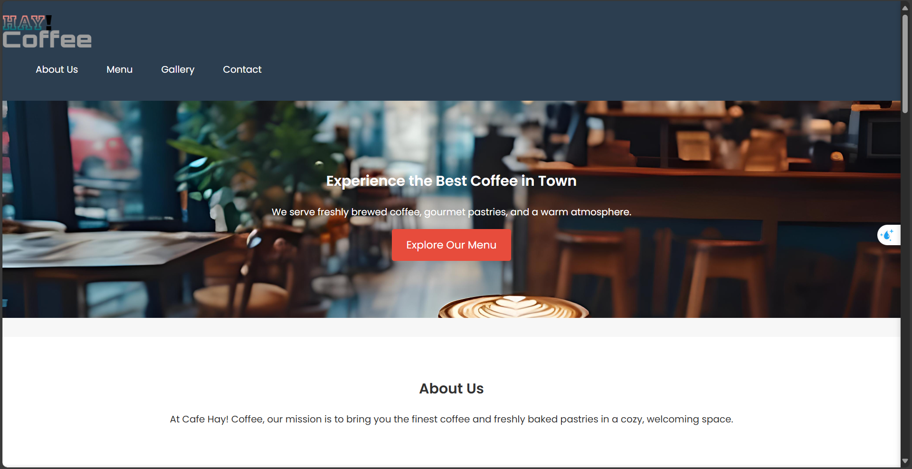
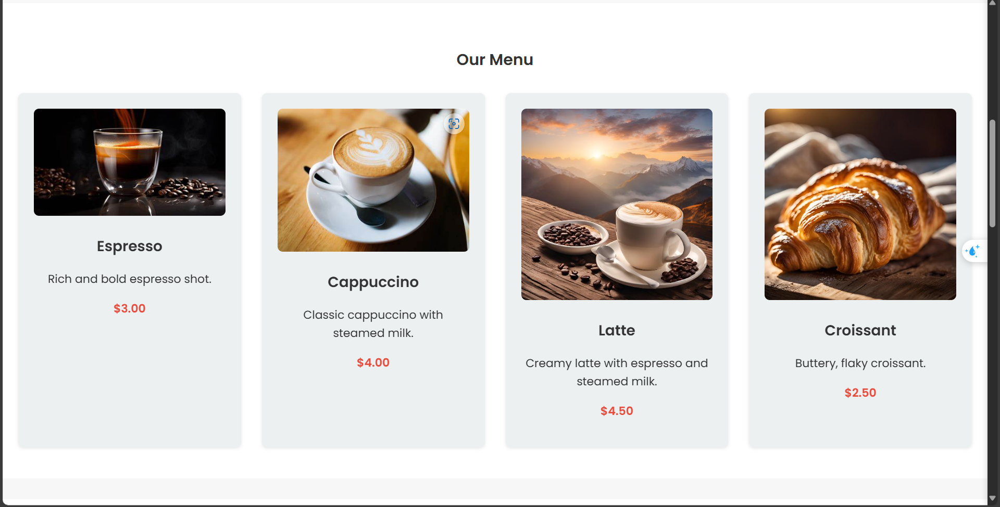

# Hay! Coffee - Fresh Coffee and Pastries Website

Welcome to **Hay! Coffee**, a sleek and modern website designed to showcase the finest coffee and freshly baked pastries. This project offers a smooth user experience with a minimalist, coffee shop-inspired design, subtle animations, and mobile-friendly layout.

## Table of Contents
- [Features](#features)
- [Technologies Used](#technologies-used)
- [Live Demo](#live-demo)
- [Screenshots](#screenshots)
- [Setup and Installation](#setup-and-installation)
- [Usage](#usage)
- [Project Structure](#project-structure)
- [Animations](#animations)
- [License](#license)

## Features
- **Responsive Design**: Optimized for all screen sizes (desktop, tablet, mobile).
- **Dynamic Menu Section**: Showcases the cafe's offerings with hover effects and slide-in animations.
- **Gallery**: A section displaying images of the cafe’s cozy environment.
- **Contact Section**: Includes an embedded Google Map and contact information for easy navigation.
- **Subtle Animations**: Enhances user experience without overwhelming the design.
- **GitHub Pages Hosting**: The website is deployed and accessible via GitHub Pages.

## Technologies Used
- **HTML5**
- **CSS3**
- **Google Fonts** (Poppins)
- **GitHub Pages**

## Live Demo
Check out the live demo of the project: [Hay! Coffee Live Demo](https://kerolosnady1.github.io/Hay-_Coffee)

## Screenshots

*The hero section with animated background and a call-to-action button.*


*The menu section with coffee items and sliding animations.*

## Setup and Installation
1. Clone the repository:
   ```bash
   git clone https://github.com/Kerolosnady1/Hay-_Coffee.git

cd Hay-_Coffee &&
open index.html

## Usage

- Explore the homepage to learn about the cafe and navigate to the menu.
- Click on "Explore Our Menu" to view detailed menu items with pricing.
- Visit the gallery to check out the cozy ambiance of Hay! Coffee.
- Use the contact section to find our location and reach out to us directly.


## Project Structure

```plaintext
Hay-_Coffee/
│
├── images/              # Folder containing all images used in the project
│   ├── logo.png
│   ├── hero-bg.jpg
│   ├── espresso.jpg
│   └── latte.jpg
│
├── style.css            # Main stylesheet for the project
├── index.html           # Main HTML file
└── README.md            # Documentation file
```
## Animations

- **Hero Section Animation**: The background image in the hero section has a sliding effect (`backgroundSlide` keyframes) that adds a dynamic touch to the homepage.
- **Menu Slide-In Animations**: Menu items slide in from the left or right when the user scrolls down (`slide-in-left` and `slide-in-right` classes).
- **Fade-In Sections**: The about, menu, gallery, and contact sections have a smooth fade-in effect when they come into view, creating a professional scrolling experience.
- **Button Hover Animation**: Call-to-action buttons have a zoom effect when hovered (`scale(1.1)`), encouraging interaction.


## License

This project is licensed under the MIT License. Feel free to use and contribute to the project!

[MIT License](LICENSE)
